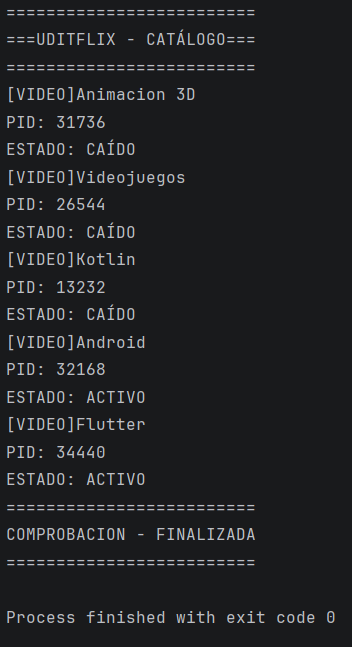

Reto 1 · Monitor del catálogo de UDITflix

Módulo: 0490 · Programación de Servicios y Procesos Autor/a: Daniel Baeza Reto: Reto-01-Monitor-Uditflix · ☑ Reto A (vídeos) · ☐ Reto B (contenidos) Tecnología: Java + ProcessBuilder (procesos del sistema operativo) RA vinculado: RA1 · Programación de aplicaciones compuestas por varios procesos

💡 Cómo usar este README: no es un trámite que se rellena al final. Es tu cuaderno de pensamiento durante el reto. Las secciones marcadas con 🧠 sirven para que pienses sobre cómo estás pensando. Si las rellenas de golpe en el último minuto, pierden todo su valor (y se nota).

📺 Qué es esta app

Un programa de consola que simula el monitor interno de UDITflix: comprueba si cada elemento del catálogo (vídeos o contenidos) está ACTIVO o CAÍDO. Para cada uno lanza un proceso externo (ping), muestra su PID, lee lo que responde y espera a que termine.

Sustituye la captura de abajo por la de tu propia ejecución antes de entregar.

🧠 Antes de empezar: planifico (5 min, sin tocar el teclado)

Responde antes de escribir una sola línea de código. No importa si te equivocas: lo importante es dejar escrito qué pensabas.

Con mis palabras, ¿qué me pide el reto? (sin copiar el enunciado) Hacer un programa en Java que compruebe si cinco vídeos del catálogo de UDITflix están disponibles, ver su PID y ver si esta ACTIVO O CAÍDO

¿Qué parte de la píldora de clase creo que voy a reutilizar? La forma de lanzar un proceso: crear el ProcessBuilder, hacer start(), leer la salida con getInputStream() y BufferedReader, y esperar con waitFor().

¿Qué parte me da más respeto o no sé por dónde empezar? No tenía claro si me tenía que fijar en el texto que devuelve ping o en el código de salida de waitFor().

Mi plan en 3-4 pasos, en orden:

Crear la matriz String[][] con los cinco vídeos: en cada fila, el nombre y la dirección 127.0.0.1 para los activos y una dirección inexistente para los caídos.
Hacer un for que recorra la matriz fila por fila.
Dentro del bucle, crear el ProcessBuilder con el ping, lanzarlo con start(), mostrar el PID, leer la salida con BufferedReader y esperar con waitFor().
Según el código de salida, decidir si es ACTIVO o CAÍDO, mostrar el resultado y, al terminar el bucle, imprimir el mensaje final.

Predicción: si todas las direcciones fueran 127.0.0.1, ¿qué estado saldría en los cinco elementos? ¿Y si todas fueran direcciones inexistentes? Con todo 127.0.0.1, los cinco saldrían ACTIVO, porque es mi propia máquina y siempre responde., y comprueba al final si acertaste

🎯 Objetivo del reto

Partir de lo aprendido en la píldora (lanzar un proceso) y dar el salto a gestionar varios procesos con una estructura de datos y un bucle, aplicando: creación de procesos con ProcessBuilder, identificación por PID, lectura de su salida, espera con waitFor() e interpretación de su resultado.

🛠️ Componentes y conceptos utilizados

Rellena la columna "con mis palabras" sin mirar tus apuntes. Después compara con ellos y corrige en otro color o con un comentario. Esa diferencia es exactamente lo que aún no tienes del todo claro.

Componente / concepto	Para qué se usa en esta app	Con mis palabras
ProcessBuilder	Prepara la orden (ping ...) que se enviará al sistema operativo	pero todavía no la ejecuta
start()	Lanza de verdad el proceso; devuelve un Process sin esperarle	Lanza de verdad el proceso y me devuelve un Process. No espera a que termine.
Process	Objeto con el que controlo el proceso que ya está en marcha	el objeto que representa el proceso ya en marcha. Con él veo su PID, leo su salida y espero a que acabe.
pid()	Número que identifica al proceso en el sistema operativo	el número con el que el sistema operativo identifica ese proceso.
getInputStream()	Canal por el que recibo lo que escribe el proceso	
BufferedReader + readLine()	Leer esa salida línea a línea	
waitFor()	Bloquea mi programa hasta que el proceso termina y devuelve su código de salida	pausa mi programa hasta que el proceso termina y devuelve su código de salida.
Matriz String[][]	Guarda, para cada elemento, su nombre y su dirección de comprobación	una tabla donde cada fila es un vídeo y cada columna un dato.
Bucle for	Repite el mismo proceso de comprobación para cada fila de la matriz	repite la misma comprobación para cada fila.

¿Qué contiene cada posición de mi matriz?

matriz[i][0] → el nombre del vídeo (por ejemplo "Kotlin").
matriz[i][1] → la dirección que compruebo con ping (127.0.0.1 si está activo, una dirección inexistente si está caído).
🚀 Cómo ejecutar el proyecto
Clonar o abrir el proyecto en IntelliJ IDEA.
Esperar a que indexe el proyecto.
Ejecutar (▶) la clase principal.

⚠️ El comando ping usa -n en Windows y -c en Linux/Mac para el número de intentos. Indica aquí con qué sistema lo has probado: (escribe aquí)

🔍 Mientras programo: mi diario de decisiones

Cada vez que te atasques, cambies de idea o algo falle, anota una entrada. Tres líneas bastan. No se trata de quedar bien: se trata de que dentro de un mes puedas reconstruir cómo pensaste.

Qué intentaba	Qué pasó realmente	Qué hice / qué aprendí
(ejemplo) Mostrar el estado de cada elemento	Todos salían ACTIVO, incluso los que debían estar caídos	Revisé qué devolvía waitFor() para una dirección inexistente y vi que...

Mi pregunta-brújula cuando me bloqueo:

¿Qué espero que haga esta línea?
¿Qué está haciendo realmente? (imprimo valores para comprobarlo)
¿En qué punto exacto se separan las dos respuestas?
🧭 De la píldora al reto: cómo di el salto

La píldora lanzaba un proceso. El reto lanza cinco. Explica ese salto con tus palabras:

¿Qué tenía la píldora que ya no me sirve tal cual? El código de la píldora lanzaba un solo proceso con una dirección fija. Ahora la dirección cambia en cada vuelta, así que no puedo dejarla escrita a mano.

¿Qué he tenido que añadir para repetirlo cinco veces? ¿Por qué esa estructura y no otra? Una matriz para guardar los datos de los cinco vídeos y un for para recorrerla. Uso for porque sé cuántas filas hay y necesito el índice i para coger el nombre y la dirección de cada una.

¿Qué parte del código es exactamente igual en todas las vueltas del bucle y qué parte cambia? Es igual todo el proceso: crear el ProcessBuilder, start(), leer la salida, waitFor() y decidir el estado. Cambian el nombre y la dirección en cada vuelta.

Si mañana UDITflix tuviera 500 elementos en lugar de 5, ¿qué tendría que cambiar en mi código? El bucle no cambiaría, solo habría más filas en la matriz. Lo ideal sería cargarlas desde un archivo en vez de escribirlas a mano.

🧠 Qué he aprendido

(Completar al terminar. Redacta con tus palabras, no con las del enunciado.)

Hilo vs. proceso: la diferencia entre ambos es... un proceso es un programa en ejecución con su propia memoria, aislado de los demás. Un hilo es una línea de ejecución dentro de un proceso y comparte memoria con los otros hilos.
PID: lo que representa y por qué cambia en cada ejecución es... es el identificador que el sistema operativo da al proceso. Cambia en cada ejecución porque se asigna uno libre en el momento de lanzarlo.
start() vs. waitFor(): lanzar un proceso y esperarle son cosas distintas porque... start() solo lanza el proceso y mi programa sigue. waitFor() espera a que termine. Sin esa espera podría intentar leer el resultado antes de que exista.
Código de salida: lo que significa que sea 0 o distinto de 0 es... 0 significa que terminó bien. Distinto de 0 significa que hubo algún fallo.
Lo que mi programa decide sobre ACTIVO / CAÍDO se basa en... (¿es fiable? ¿en qué casos podría equivocarse?) mi programa lo decide con el resultado de ping. No es del todo fiable: un servidor puede estar bien pero bloquear el ping, o puede fallar la red un momento. Además, en Windows ping a veces devuelve 0 aunque el destino sea inalcanzable.
🐞 Dificultades y cómo las resolví

(Completar antes de entregar. Reúne lo más importante de tu diario de decisiones.)

Dificultad 1:

Qué síntoma vi: algunos vídeos que debían salir CAÍDO aparecían como ACTIVO.
Cuál era la causa real: en Windows, ping puede devolver código de salida 0 aunque no llegue al destino, así que waitFor() no bastaba para decidir el estado.
Cómo la encontré: imprimí el código de salida y el texto que devolvía ping para una dirección inexistente, y vi dónde se separaban lo que esperaba y lo que pasaba.
Cómo evitaré que me vuelva a pasar: no fiarme de un solo dato. Comprobar también el texto de la salida y probar siempre con un caso que sé que falla.

Dificultad 2: (opcional)

🪞 Autoevaluación

Marca con honestidad, no con optimismo. Nadie te califica esta sección: es para ti y para que el profesor sepa dónde ayudarte.

Puedo explicar a un compañero...	🔴 No	🟡 Más o menos	🟢 Sí
Qué hace ProcessBuilder	☐	☑ 🟡	☐
Qué hace start() y por qué no espera	☐	☐	☑ 🟢
Qué representa el PID	☐	☐	☑ 🟢
Para qué sirve getInputStream()	☐	☑ 🟡	☐
Qué hace waitFor() y qué devuelve	☐	☑ 🟡	☐
Qué hay en cada posición de la matriz	☐	☐	☑ 🟢
Qué hace el for en mi programa	☐	☐	☑ 🟢

Mi predicción del principio, ¿acerté? (escribe aquí y explica por qué sí o por qué no)

Lo que haría diferente si empezara de nuevo: (escribe aquí)

Lo que todavía no tengo claro y quiero preguntar en clase: (escribe aquí)

🤝 Declaración de autoría

Este reto no permite herramientas de generación de código mediante IA. Consulté únicamente: la píldora de clase, mis apuntes, la documentación de Java e IntelliJ IDEA.

☐ Confirmo que el código es mío y que puedo explicarlo línea a línea.

📂 Estructura del proyecto
src/main/java/org/example/   → clase con el main (el monitor de UDITflix)
README.md                    → este documento

(Ajusta la estructura a la de tu proyecto.)

🔗 Enlace
GitHub: https://github.com/Chacal231

Imagen de la consola

